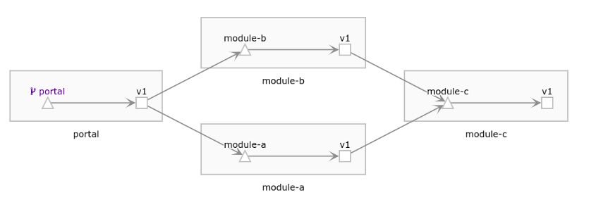

# Istio-Sample: 基于 Spring Boot 的 Istio 平台简单示例

## 简介

* 此项目用于测试 Spring Boot 在脱离 Spring Cloud 微服务开发框架，在 Kubernetes 和 Istio 之中完成微服务架构的方案。
* 总版本为 `1.0.0`，是测试没有其他版本的调用方案，如您需要教程中的其他版本，可按照教程切换 Git Tag 来获取部署方案。您无需关注项目代码，只需运用部署所需的全部或部分 YAML 配置文件即可。
* 如遇公库镜像丢失，请及时提交 Issue 告知作者。
* 本项目依赖于 `Rancher 2.1.1` 所搭建的 Kubernetes 和 Istio 环境，您可参考 [Rancher 官方文档](https://rancher.com/docs/rancher/v2.x/en/) 简易搭建属于您自己的学习环境，也可以将其用于生产。
* 参考文档：
  * [Rancher 官方网站](https://rancher.com)  - [官方文档](https://rancher.com/docs/rancher/v2.x/en/)
  * [Istio Service Mesh 官方网站](https://istio.io/) - [官方文档](https://istio.io/docs/)
  * [Kubernetes 官方网站](https://kubernetes.io/) - [官方文档](https://kubernetes.io/docs/)
  * [Docker 官方网站](https://docker.com) - [官方文档](https://docs.docker.com/)

## 模块结构

### portal

充当软件网关的唯一交互界面，是用户可以唯一访问的入口。

公库测试镜像：`okeyja/istio-sample-portal:1.0.0`

| API | 作用 |
| ---- | ------ |
| /ping | 返回 portal 自己的名字。 |
| /ping/module-a | 调用 model-a 的 ping。 |
| /ping/module-b | 调用 model-b 的 ping。 |
| /module-a/ping/module-c | 调用 model-a 的 ping model-c，以调用 model-c 的 ping。 |
| /module-b/ping/module-c | 调用 model-b 的 ping model-c，以调用 model-c 的 ping。 |

### module-a

模块 A ，第一层微服务调用的模块。

公库测试镜像：`okeyja/istio-sample-module-a:1.0.0`

| API            | 作用                       |
| -------------- | -------------------------- |
| /ping          | 返回 module-a 自己的名字。 |
| /ping/module-c | 调用 model-c 的 ping。     |

### module-b

模块 B，第一层微服务调用的模块。

公库测试镜像：`okeyja/istio-sample-module-b:1.0.0`

| API            | 作用                       |
| -------------- | -------------------------- |
| /ping          | 返回 module-b 自己的名字。 |
| /ping/module-c | 调用 model-c 的 ping。     |

### module-c

模块 C，第二层微服务调用的模块。

公库测试镜像：`okeyja/istio-sample-module-c:1.0.0`

| API            | 作用                       |
| -------------- | -------------------------- |
| /ping          | 返回 module-c 自己的名字。 |

## 调用关系

此图是像由 Kiali 生成的模块间调用关系。

## 部署 YAML 配置文件

`istio-sample-deployment.yml` 将自动从公库中拉取镜像部署所有服务。

`istio-sample-ingress-gateway.yml` 将按照 Kubernetes 编排映射规则建立对外的访问网关。

也可以在几个模块中独自运行，除截取 `istio-sample-deployment.yml` 部分代码外，您还可以在模块目录中找到

## 进步开发

示例方案 **不推荐**您进行进步开发，因为这将需要您大量的修改配置。

如有需求，推荐您使用下面的开发工具（集合）：

| 工具                | 作用 |
| ------------------- | ---- |
| OpenJDK 11.0.4 2019-01-16 | Java 开发运行环境及集成套件 |
| Apache Maven 3.6.0 | Java 依赖管理工具 |
| IntelliJ IDEA 2019 | 集成开发环境 |
| Docker Community Edition 19.03.5 | Docker 容器编译环境 |

进步开发需要您编译打包好您的 Java 程序，并打成 Docker 容器镜像，推送到您自己的私有或共有仓库中，这需要您配置所有 YAML 中的镜像地址。

## LICENSE

[Apache LICENSE 2.0](LICENSE) (Implemented From Spring Framework)